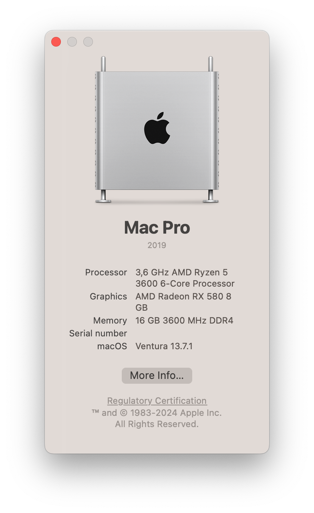

# Meshy Mac

Yet another collection of OpenCore configuration files that allow me to run macOS on my desktop PC.
I'm using Opencore [1.0.3](https://github.com/acidanthera/OpenCorePkg/releases/tag/1.0.3) and macOS Ventura (13.7.1).

    

### BIOS Settings

Currently running version [F17](https://download.gigabyte.com/FileList/BIOS/mb_bios_b550i-aorus-pro-ax_f17.zip?v=3bd32cfd4af05a3fb7ce73b5890a9600). 

I tried to update to the latest, but I got [Stuck on [EB|#LOG:EXITBS:START]](https://dortania.github.io/OpenCore-Install-Guide/troubleshooting/extended/kernel-issues.html#stuck-on-eb-log-exitbs-start) - it could be due to a failed upgrade attempt (via Apple Update), bad VBIOS (I have since reflashed my card), changed SSDTs or misconfigured BIOS + config.plist. I did not investigate since there were too many variables and chose to use what I know works.

| Setting | Value|
| -----------------: | :------------ |
|   Above 4G Decoding | Enabled       |
| Re-size BAR Support | Auto          |
|               IOMMU | Disabled (2x) |
|                 CSM | Disabled      |
|           Fast Boot | Disabled      |
|         Secure Boot | Disabled      |

## PC Specs

| Component | Description                              |
| --------: | :--------------------------------------- |
|       CPU | AMD Ryzen 5 3600                         |
|        MB | Gigabyte B550I AORUS PRO AX (rev. 1.0)   |
|       RAM | Crucial Ballistix 16GB DDR4 3600MHz CL16 |
|       GPU | ASUS Dual OC RX580 8GB                  |
|       SSD | WD Black SN770                           |
| WIFI & BT | Intel Wi-Fi 6 AX200 (onboard)            |
|       LAN | Realtek 2.5GbE                           |
|     Audio | ALC1220-VB                               |

---
## Known Issues

- I have an M.2 drive (SK Hynix) for Windows dual boot - and it is delaying the boot time. Without it macOS starts a lot faster